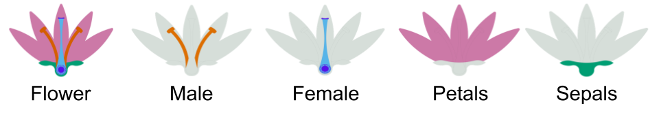

# The maleness of larger angiosperm flowers

_Gustavo Brant Paterno, Carina Lima Silveira, Johannes Kollmann, Mark Westoby,
and Carlos Roberto Fonseca_  

    
***

**Journal**: [PNAS](https://doi.org/10.1073/pnas.1910631117)

**DOI**: [https://doi.org/10.1073/pnas.1910631117](https://doi.org/10.1073/pnas.1910631117)

**Supporting information**: [link](https://www.pnas.org/content/pnas/suppl/2020/05/03/1910631117.DCSupplemental/pnas.1910631117.sapp.pdf)

## Content of the repository

1. __Data__: the folder `data` contains  
    * The raw and processed data files with flower biomass partition (.csv) 
    * The phylogenetic trees used in the study (.tre)

2. __Images__: the folder `images` contains  
    * Flower drawings used in the manuscript figures.

3. __Outputs__: the folder `outputs` contains  
    * The figures, tables and temporary files generated.
    
4. __R__: the folder `R` contains  
    * Scripts (.R) to generate all figures and tables used in the manuscript and in the supporting information.
    
***

When using the __data available__ in this repository, please cite the original publication and the dataset.  

Contact paternogbc@gmail.com for any further information.  

**Citation:**

> **Paterno, G. B.**, Silveira, C. L., Kollmann, J., Westoby, M., & Fonseca, C. R. (2020). The maleness of larger angiosperm flowers. Proceedings of the National Academy of Sciences, 117(20), 10921–10926. https://doi.org/10.1073/pnas.1910631117
***

__Dataset DOI__

Gustavo Brant Paterno, Carina Lima Silveira, Johannes Kollmann, Mark Westoby, & Carlos Roberto Fonseca. (2020). Data and code for: The maleness of larger angiosperm flowers (v1.0.0) [Data set]. Zenodo. https://doi.org/10.5281/zenodo.3746453

__Open Science Framework__

See the manuscript [OSF Project](https://osf.io/swhd9/) for supporting information.
